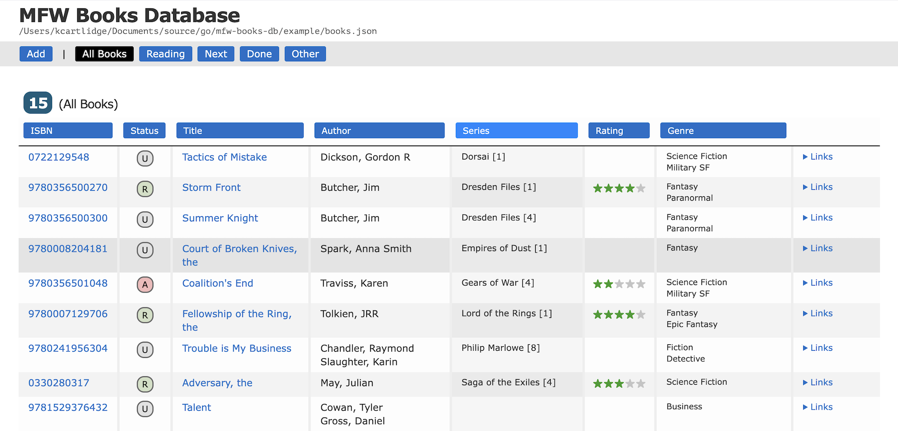

# MFW Books DB

Manage your physical book collection. Run your own catalog website and add one or more books by ISBN search against the Google Books API. All backed by a plain-text human-readable JSON file (no database needed).

Copyright 2025 K Cartlidge - [AGPL license](./LICENSE.txt)

- Book management website (deliberately simple and fast)
    - Maintains your collection in a readable/editable JSON format
    - Auto-backups with one file per day that has changes
- Add single books in the web UI by ISBN search
- Bulk book import from a text file of ISBNs
    - Fetches book metadata from Google Books
    - Skips ISBNs already successfully fetched previously
    - Tidies title and authors for better auto-content
- No external dependencies (other than optionally an ISBN scanner)
- Print-friendly screens (also works when printing to PDF)

ISBNs can be scanned in via mobile apps like [Alfa ISBN Scanner](https://www.alfaebooks.com/help/isbn_scanner) which lets you gather ISBNs then share them to an email as a text file suitable for input here.

*Screenshot:*



*Example Printing:*


---

**WARNING:**
Working on a JSON (or any) file stored on some cloud syncing services can screw up the file.  For example I've seen PCloud append masses of NULLs to the JSON file after an edit.  *To be safe, make changes on a local version and copy or sync it to your backups afterward.*

## Contents

- [Usage](#usage)
    - [Launching the Website](#launching-the-website)
    - [Importing a single book by ISBN](#importing-a-single-book-by-isbn)
    - [Importing from a List of ISBNs](#importing-from-a-list-of-isbns)
- [File Formats](#file-formats)
- [Error Handling](#error-handling)
- [API Rate Limits](#api-rate-limits)
- [Program Rate Limiting](#program-rate-limiting)
- [Producing New Builds](#producing-new-builds)

## Usage

There are builds for Mac, Windows, and Linux in the [builds](./cmd/builds) folder.
Download the relevant one and place it somewhere reachable in your `PATH`.
There are *no* external dependencies to install.

### Launching the Website

- Specify a port at launch you'll get a web site
    ```bash
    cd <wherever>
    ./mfw-books-db  -file books.json -serve 8000
    ```
- Open the website (eg http://localhost:8000)

You can also include an ISBN import and the import will run before the website is launched.
See the next section for details.

### Importing a single book by ISBN

The website menu includes an `Add` button.
Use it to provide an ISBN and it will add a book via the Google Books API.

### Importing from a List of ISBNs

- Create a text file with one ISBN per line
- Run your downloaded build, providing filenames
    ```bash
    cd <wherever>
    ./mfw-books-db  -file books.json -isbns isbns.txt
    ```
- Results will be written/updated in the specified JSON file
- Repeat from step 3 to add more ISBNS (duplicates are ignored)

## File Formats

`isbns.txt` is an example optional file for importing books in bulk:

    9781841493138
    9781841493145
    9781841493152

`books.json` is your book database and is used/updated by the website:

``` json
[
    {
    "id": "WwB7QgAACAAJ",
    "isbn": "033026656X",
    "title": "Many-Colored Land, the",
    "authors": [
        "Julian May"
    ],
    "genre": [
        "Science Fiction",
        "Fantasy"
    ],
    "link": "https://www.googleapis.com/books/v1/volumes/WwB7QgAACAAJ",
    "publishedDate": "1982",
    "publisher": "Pan",
    "pageCount": 411,
    "language": "en",
    "description": "This is the first book in The Saga of the Exiles series. Among the misfits and mavericks of the 22nd century, there are those who pass through the time-doors of the Pliocene Epoch into the battleground of two warring races from a planet far away.",
    "authorSort": [
        "May, Julian"
    ],
    "series": "Saga of the Exiles",
    "sequence": "1",
    "status": "R - Read",
    "rating": 5,
    "notes": "",
    "statusIcon": "R",
    "modifiedUtc": "2025-05-01T18:48:16Z",
    "isException": false,
    "exceptionReason": ""
    },
    ...
]
```

You should never need to edit the `books.json` file manually, except for 2 situations:

- You want to do bulk updates and it's easier using search/replace or similar in a text editor
- You want to add a book that has no ISBN (such as a really old one)
    - The ISBN is only checked for minimum length so you can use anything
    - It needs to be unique in the file (eg `my-really-old-textbook-1`)

## Error Handling

The program includes error handling for:
- Rate limit errors
- Network errors
- Missing or invalid ISBNs
- API response errors

Failed requests will still be added to the JSON file but with the exception flagged. The program will continue processing remaining ISBNs.  As they have been added the errors will show in the book list (highlighted red).  They will usually sort at the top.

You can also pass `--clear-errors` at launch to remove errors from your JSON file automatically, which means if their ISBNs are in an import file they will be re-tried.  You may prefer to fill in their details manually by editing their entry in `books.json` (you should set also `isException` to `false` in its entry).

## API Rate Limits

We use the Google Books API.

- Free tier: 1,000 requests per day
- No authentication required for basic queries
- No per-second rate limit specified
- **We hit Google Books API twice per book**
    - The first queries the book details by ISBN
    - The second queries again by the fetched Google Books ID
        - This provides better genres, publisher, and page count
        - There's a `--single-hit` option to disable this second hit
    - You can run again the following day (use `--clear-errors` as detailed above)

## Program Rate Limiting

The program implements its own rate limiting to avoid being caught by Google's:
- 333ms delay between requests (3 requests per second)
- Up to 3 retries for failed requests
- 2-second delay between retries
- Automatic handling of rate limit errors (HTTP 429)
- Rate limits and retries don't apply to the optional 2nd hit

## Producing New Builds

There are 3 scripts for producing builds, one each for Mac, Windows, and Linux.
*Run the one that relates to your system, not your build target.*

When run, those scripts will generate new builds for all platforms and place them in the `cmd/builds` folder.

Be sure to run the scripts from within the `cmd` folder.

    cd cmd
    ./scripts/macos.sh
    ./scripts/linux.sh
    scripts\windows.bat

For Mac and Linux you may need to `chmod a+x` to make them executable first.
